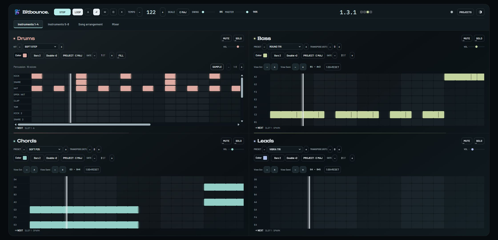
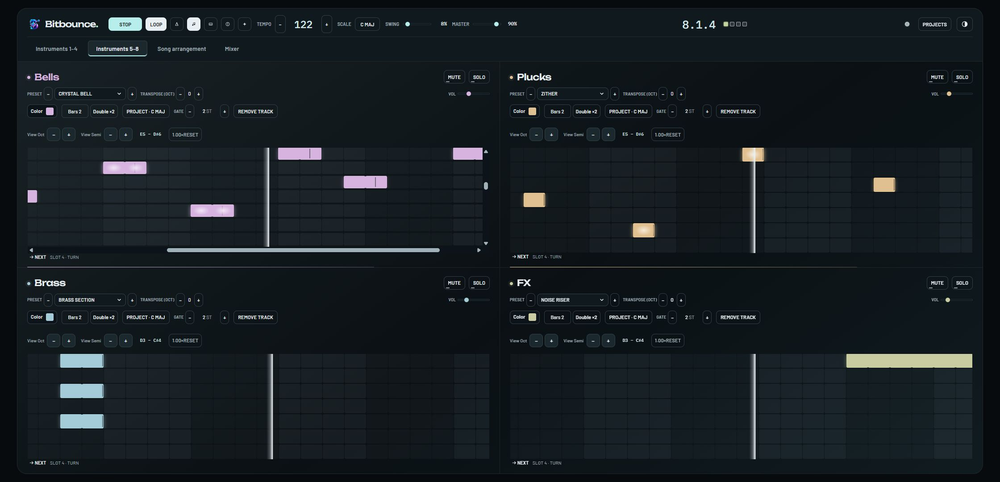
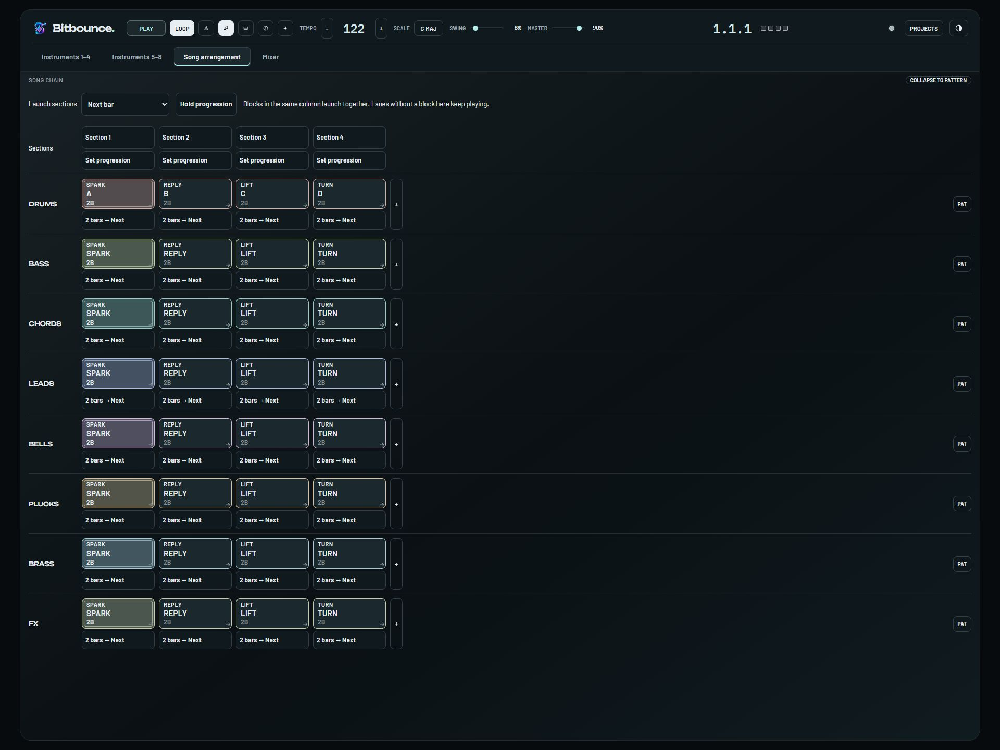
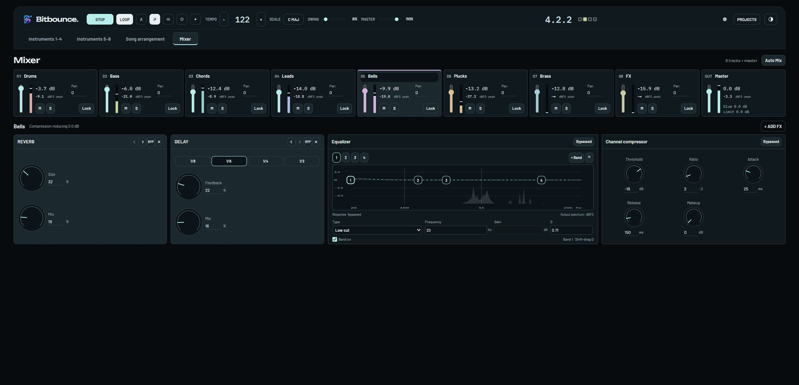
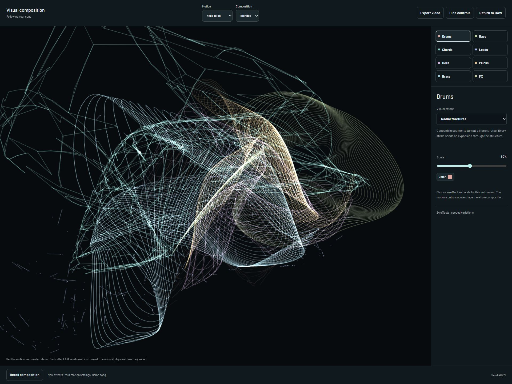

# bitbounce.app

### Create patterns. Arrange the song. Shape the mix. Build a visualizer. Bounce it.

A browser music studio with scale-aware note grids, a growing sound library, an arrangement workspace, and live audio effects. Build a beat by hand or work with a compatible browser agent through WebMCP.

**[Open bitbounce.app](https://bitbounce.app/) · [First session](#make-your-first-track) · [Controls](#write-and-shape-a-pattern) · [Exports](#choose-the-right-export) · [Run locally](#run-locally)**



*The core instrument workspace during playback: edit the drum, bass, chord, and lead patterns beside their sound and timing controls.*

## The studio at a glance

| Instruments | Song | Mixer | Visualizer |
| --- | --- | --- | --- |
| Choose sounds and draw notes. | Turn patterns into an arrangement. | Balance tracks and shape their processing. | Build moving artwork driven by the music. |
| Four core tracks plus four optional pitched instruments. | Copy, reuse, repeat, and launch blocks or sections. | Track/master effects, EQ, compression, and measured Auto Mix suggestions. | Per-instrument effects, color, scale, motion, and MP4 export. |

The current library contains **836 pitched presets across 18 categories** and **80 drum kits with 16 slots each**. Projects save locally in your browser, with downloadable project files for backup and transfer. No account is required.

## Make your first track

1. Open **Projects** and choose a built-in demo to hear how its parts fit together. Demos remain previews until your first edit creates a local copy.
2. Press **Play** to start audio, then select an instrument and edit its pattern. Use Preview to audition newly placed notes.
3. Open a sound's name to browse the library. Tap a candidate to hear a phrase or kit rhythm, then choose **Use sound** to apply it.
4. Move to **Song** to duplicate patterns, reuse them, and organize the sequence into sections.
5. Open **Mixer** to set levels, pan, EQ, compression, and creative effects while the song plays.
6. Open **VIZ** to build the visual composition. Export WAV for audio, MIDI for notes, MP4 for a visualizer video, or SAVE FILE to keep the editable project.

**KEYS ?** opens the shortcut reference. **INFO ?** explains a control when you hover, focus, or tap it. In INFO mode, tapping a control still activates it. Playback continues as you switch workspaces.

## Write and shape a pattern

| Control | Behavior | Why it matters |
| --- | --- | --- |
| **Note grid** | Place notes and drag to create a duration; resize a note from its edge. | Sketch rhythm and melody directly. |
| **Project scale / track scale** | Choose a shared note pool or override it for an individual pitched track. | Explore musical relationships without entering every pitch manually. |
| **Gate** | Sets the duration used for a newly placed single-click note. | Establish a short pluck or longer held-note default. |
| **Transpose** | Moves a pitched track's sound up or down by octaves. | Change its audible register without redrawing the pattern. |
| **View Oct / View Semi** | Changes the rows visible in the editing window. | Reach another register without transposing the sound. |
| **Bars / pattern length** | Sets a whole-number pattern length from 1 to 128 bars. Notes beyond a shortened boundary are retained as overflow for later growth. | Try a shorter phrase without immediately destroying the hidden material. |
| **Double ×2** | Repeats visible pattern content into a longer version, replacing retained hidden overflow. | Build a variation from an existing phrase. Doubling is available up to 64 bars. |
| **Drum SAMPLE: GATE / ONE-SHOT** | GATE follows the hit length; ONE-SHOT plays the whole sound and ignores that length. | Choose between duration-controlled hits and complete one-shots. |
| **Euclidean fill** | Spreads a drum row's hits using fill controls, followed by manual editing. | Find a rhythmic starting point. |
| **Tempo / Swing** | Changes speed and the timing of alternating sixteenth-note steps. | Shape the groove while keeping notes in musical time. |
| **Preview / Metronome** | Auditions placed notes or adds a timing reference during playback. | Hear edits clearly while writing. The metronome is excluded from exports. |

The four core lanes are drums, bass, chords, and lead. Four additional pitched tracks can be added. Every pitched track can choose from the full pitched library; a track's starting role does not lock it to that category.



*The four extra pitched tracks in the same project: Bells, Plucks, Brass, and FX, each with its own sound and pattern controls.*

### Find a sound before committing it

| Library control | What it changes |
| --- | --- |
| **Search** | Finds sounds by name, family, or character, such as dark bass or soft bells. |
| **Categories** | Narrows the instrument family or drum-kit family. |
| **Character filters** | Bright/Dark, Soft/Punchy, Clean/Gritty, Short/Sustained. |
| **Favorites / Recent** | Returns to sounds you've marked or used on this device. |
| **Preview** | Plays a short phrase or kit rhythm while leaving the track unchanged. |
| **Use sound** | Applies the candidate to the selected track. Closing the browser leaves the original choice intact. |

Most sounds are synthesized. The library includes six pitched recording-based presets; four drum kits include recorded slots alongside synthesis. Names such as guitars, woodwinds, or synth vocals describe the sound design, not a claim that the entire library is an acoustic sample pack. See the [sound-library breakdown](docs/dev/sound-library.md) and [sample provenance](PROVENANCE.md).

## Turn patterns into a song



*All eight tracks in the Song workspace, with four sections and each lane's pattern blocks and playback rules visible.*

The Song workspace separates the pattern itself from the places where it appears in an arrangement.

| Operation | Result |
| --- | --- |
| **Copy / Paste after / Duplicate block** | Creates independent pattern content that can diverge from its source. |
| **Reuse pattern** | Refers to the same pattern, so an edit affects its reused instances. |
| **Block playback rule** | Sets a duration in bars or repeats, or holds the block. |
| **Follow action** | Chooses Next, Previous, Go to, Random other, Return, or Stop lane for live progression. |
| **Section launch** | Queues participating tracks together at the selected musical boundary. |
| **Section names and progression** | Labels arrangement columns and controls how sections advance during live playback. |

This makes it possible to repeat a rhythm under changing melodies or launch several tracks into a new section together. Live playback rules and file exports have different purposes: the WAV export follows finite left-to-right block order, while live jumps and random actions remain performance behavior. See the export table before choosing a format.

## Mix the parts together



*Balance eight tracks alongside Master, then inspect the selected track's processing. Bells is selected here, with reverb, delay, EQ, and compression controls visible.*

Select a track or Master to inspect its processing. The device rack runs from left to right, with controls to reorder, bypass, and remove devices.

| Mixer area | Controls |
| --- | --- |
| **Channel strip** | Level, mute, solo, stereo pan, post-processing meter, Auto Mix lock. |
| **Equalizer** | Up to eight bands with type, frequency, gain, and Q; draggable nodes and bypass controls. |
| **Compression** | Threshold, ratio, attack, release, makeup gain, and bypass. |
| **Creative effects** | Filter, drive, bitcrusher, tempo-synced delay, and reverb. Track racks allow up to three devices; the master rack allows up to eight. |
| **Master processing** | Combined-output EQ/dynamics and a sample-peak limiter. |
| **Auto Mix** | Local analysis, adjustable Balance/EQ/Dynamics contribution, matched-volume before/after audition, Apply, and Restore. |

Auto Mix proposes bounded changes and leaves locked tracks alone. Apply is an undoable edit. The measurements help diagnose balance, but listening is still part of deciding whether a mix improved. Sample peak and active RMS measurements are not LUFS or true-peak measurements, and the limiter should not be described as a true-peak limiter.

## Give the song a visual identity



*The visual composition with its instrument layers and editing controls. This view selects the Drums layer and its Radial fractures effect.*

The visualizer follows note events and musical phrasing. Each instrument has its own visual layer, so the arrangement becomes part of the composition.

| Control | Visual effect |
| --- | --- |
| **Select instrument / Visual effect** | Changes the selected instrument's artwork while retaining the others. |
| **Track color / Scale** | Sets that layer's color and size without changing audio volume. |
| **Motion** | Chooses Fluid folds, Flowing trails, or Orbit behavior. |
| **Instrument blending** | Brings forms together or gives them more separation in the supported motion modes. |
| **Orbit strength** | Sets how far a layer moves from the shared center. |
| **Reroll composition** | Changes effects, geometric variations, and starting angles while preserving the song and sounds. |
| **Hide controls** | Presents the composition without its editing controls. |
| **Export video** | Renders, previews, and saves an MP4 on the device. |

## Choose the right export

| Format | Includes | Important boundary |
| --- | --- | --- |
| **WAV** | 16-bit stereo audio of the finite left-to-right arrangement, including mix/effects and the release tail. | Blocks use their configured bars or repeats; held blocks play once. Shorter tracks finish, and the longest determines the song ending. Live jumps and random launches are excluded. |
| **Song MIDI** | A Type-1 MIDI file for the complete song cycle, including tempo, notes, scale/transposition, swing, chord notes, cues, and GM drum mapping. | Uses cycle-based arrangement semantics. MIDI carries notes and timing, not Bitbounce's custom sound or effects. |
| **Pattern MIDI** | The selected pattern, including its full bar length and trailing silence. | Excludes arrangement repeats and live actions. Notes are bounded to the pattern end. |
| **MP4** | Visualizer composition with audio, H.264/AAC, 30 fps; 1920×1080 or 1080×1920. | Uses the visualizer's song-cycle plan, with full-cycle or selected-bar export. It is not a recording of manual live launches. |
| **.bitbounce.json** | Editable project data for reopening in Bitbounce. | Use this to preserve editable music; a WAV or MIDI file is not a full project backup. |

For Song MIDI and MP4, a cycle walks each arranged pattern using its own pattern length, then repeats shorter track chains to their least-common-multiple cycle. These exports do not apply the block bars/repeats/holds used by finite WAV rendering.

MP4 export requires browser support for both video and audio encoding. The complete song cycle must fit within five minutes, even when exporting only a section. Keep the tab open; cancellation may wait for an already-running offline audio render to finish. The exporter reports unsupported encoding rather than silently changing formats.

## Local projects and agent-assisted editing

Projects autosave to IndexedDB in the current browser profile. **SAVE FILE** downloads an editable backup; **OPEN FILE** imports it as a new project. Browser storage can be cleared, so keep external backups of work you care about.

### WebMCP

On a compatible browser or extension, Bitbounce registers tools when the model-context API becomes available. The site includes no AI model, chat service, API key, or remote MCP server.

Before a modifying action, the agent must ask whether to edit the current project or start a new one, then record the confirmed destination through the app's tool. The app validates that request and the current revision; it cannot independently verify what was said in the conversation.

| Tool family | Purpose |
| --- | --- |
| **Inspect and discover** | Read the project, patterns, session, document rules, and searchable sound catalog. |
| **Validate and preview** | Check a draft and inspect proposed changes before applying them. |
| **Edit** | Apply focused operations or a full validated document as an undoable change. |
| **Analyze and propose** | Measure audio locally and prepare a separately applicable mix proposal. |
| **Session and export** | Control supported playback/view actions and request local downloads after destination confirmation. |

**Restore before agent** returns to the checkpoint taken before the first agent edit. It also removes manual changes made after that checkpoint. The checkpoint is session-scoped, and project Undo cannot undo a completed download. See the [full tool and recovery guide](docs/dev/webmcp.md).

The application is local-first: project persistence and audio rendering run in the browser, with bundled assets loaded from the app's origin. When you connect an external agent, project information returned through tools enters that agent's context and may be processed by its provider.

## Under the console

| Layer | Technology | Role in Bitbounce |
| --- | --- | --- |
| **Interface** | SolidJS + TypeScript | Reactive controls, workspaces, dialogs, and meters. |
| **Document state** | Zustand, Zundo, Valibot | Central project state, undo history, schema validation, and revision-aware edits. |
| **Sound** | Web Audio + AudioWorklet | Scheduling, synthesis, samples, track processing, and live playback. |
| **Offline audio** | Offline rendering and WAV encoder | File rendering independent of the live playback graph. |
| **Persistence** | IndexedDB through idb | Local projects, autosave, and recovery. |
| **MIDI** | midi-file | Standard MIDI byte encoding around the app's musical event model. |
| **Visualizer video** | Canvas composition + Mediabunny | Device-local frame generation and MP4 encoding. |
| **Build and checks** | Vite, TypeScript, ESLint, Vitest, Playwright | Production bundling, static checks, unit tests, and real-browser verification. |

The project document is the shared source for manual edits, validated agent edits, playback compilation, and exports. Exporters intentionally choose different arrangement plans, which is why the format table distinguishes a finite song from a repeating cycle.

## Run locally

Use Node.js and npm versions compatible with the repository's locked tooling. The existing project guidance targets Node.js 22 or newer.

```bash
git clone https://github.com/Arrangedgodly/DAW.git bitbounce
cd bitbounce
npm ci
npm run dev
```

Open the localhost address printed by Vite. Desktop Chrome or Edge is the primary browser target. Audio needs Web Audio/AudioWorklet support and a secure context; localhost is the intended development origin.

| Command | Purpose |
| --- | --- |
| `npm run build` | Type-check and build `dist/`. |
| `npm run preview` | Serve the production build locally. |
| `npm test` | Unit suite. |
| `npm run test:browser` | Browser suite through the configured test environment. |
| `npm run typecheck` | TypeScript checks without emitting files. |
| `npm run lint` | ESLint checks. |
| `npm run check:bundle` | Bundle-budget check. |

Browser tests require their configured Playwright browser environment. Encoding checks also depend on native codec availability. See [current test contracts](docs/dev/testing-current.md) and [browser support](docs/dev/browser-support.md) rather than treating every operating system as equivalent.

<details>
<summary><strong>Source map and deeper documentation</strong></summary>

| Area | Entry point |
| --- | --- |
| Workspace shell | [`src/App.tsx`](src/App.tsx) |
| Project schema and validation | [`src/document/`](src/document/) |
| State and undo | [`src/state/`](src/state/) |
| Audio engine and renderers | [`src/audio/`](src/audio/), [`src/engine/`](src/engine/) |
| Local storage and project files | [`src/persist/`](src/persist/) |
| Visualizer composition/export | [`src/viz/`](src/viz/) |
| Agent tools | [`src/webmcp/`](src/webmcp/) |
| Sound library | [`docs/dev/sound-library.md`](docs/dev/sound-library.md) |
| Keyboard controls | [`docs/dev/keyboard.md`](docs/dev/keyboard.md) |

</details>

## Support and licensing

Desktop Chromium and Android Chrome are the primary targets. Firefox is best-effort and Safari is experimental. A browser without required audio capabilities may allow editing while reporting that sound is unavailable. Physical-device MP4 export should be tested on the device you intend to use.

Project code is [MIT licensed](LICENSE). Bundled recordings have per-file provenance in [PROVENANCE.md](PROVENANCE.md). Synthesized instrument names describe interpretations of those sounds; exported MIDI cannot recreate the custom timbre by itself.
